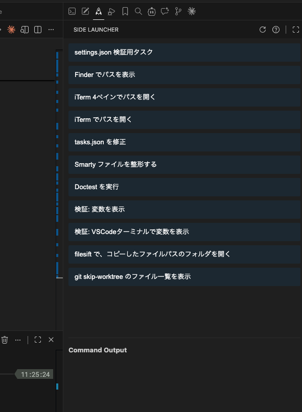

# Side Launcher

A VSCode extension that adds a command launcher to the sidebar. Easily run your frequently used commands.



## Features

- **Sidebar Launcher**: Display command execution buttons in the VSCode sidebar
- **Custom Command Configuration**: Define commands via VSCode settings or an external JSON file
- **Execution Mode Selection**: Choose between child_process or VSCode terminal execution
- **Workspace Integration**: Access project paths using `$VSCODE_WORKSPACE_ROOT` and `$WORKSPACE_ROOT` environment variables
- **File Integration**: Access current file info via `$CURRENT_FILE_ABSOLUTE_PATH` and `$CURRENT_FILE_RELATIVE_PATH`
- **Real-time Output**: View command results in real time
- **Error Debugging**: Identify error causes with stack trace display

## Command Configuration

### VSCode Settings

Add the following to your `settings.json`:

```json
{
  "sideLauncher.tasks": [
    {
      "label": "Run Tests",
      "type": "shell",
      "command": "cd $WORKSPACE_ROOT && npm test"
    },
    {
      "label": "Build (Run in VSCode Terminal)",
      "type": "shellOnVSCode",
      "command": "cd $WORKSPACE_ROOT && npm run build"
    },
    {
      "label": "Git Add Current File",
      "type": "shellOnVSCode",
      "command": "git add $CURRENT_FILE_RELATIVE_PATH"
    }
  ]
}
```

### External JSON File

You can also configure tasks in `${HOME}/.config/vscode-side-launcher/tasks.json`:

```json
[
  {
    "label": "Git Status (Run in Terminal)",
    "type": "shellOnVSCode",
    "command": "cd $VSCODE_WORKSPACE_ROOT && git status"
  },
  {
    "label": "Project Info",
    "type": "shell",
    "command": "ls -la $WORKSPACE_ROOT"
  },
  {
    "label": "Show Current File Path",
    "type": "shell",
    "command": "echo \"Absolute: $CURRENT_FILE_ABSOLUTE_PATH\" && echo \"Relative: $CURRENT_FILE_RELATIVE_PATH\""
  }
]
```

## Environment Variables

The following environment variables are available in commands:

- `$VSCODE_WORKSPACE_ROOT`: Root path of the workspace opened in VSCode
- `$WORKSPACE_ROOT`: Shorthand for the above
- `$CURRENT_FILE_ABSOLUTE_PATH`: Absolute path of the currently open file
- `$CURRENT_FILE_RELATIVE_PATH`: Relative path of the currently open file from the project root

## Configuration

### `sideLauncher.tasks`

An array of task definitions. Each task has the following properties:

- `label` (required): Display name of the command
- `command` (required): Command to execute
- `type` (optional): Command type
  - `shell` (default): Execute via child_process and display results in the sidebar
  - `shellOnVSCode`: Execute in the VSCode terminal

## Installation

1. Clone this repository
2. Run `npm install` to install dependencies
3. Run `npm run compile` to compile
4. Press F5 to launch the extension in debug mode

## Development

### Version Management

```bash
npm run update-version
```

Automatically updates the version number based on the Git commit count.

### Build

```bash
npm run compile
```

### Test

```bash
npm test
```

## Release Notes

### 0.1.x

- Task definition loading from VSCode settings and external JSON files
- Environment variables for workspace root path
- Stack trace display on errors
- Separated HTML/TS and dynamic button generation
- Version management system
- `shellOnVSCode` type for command execution in the VSCode terminal
- Environment variables for current file info (`CURRENT_FILE_ABSOLUTE_PATH`, `CURRENT_FILE_RELATIVE_PATH`)

## License

MIT License
